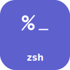
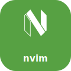
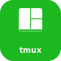
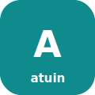
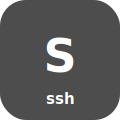
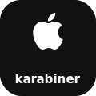

<h1 align="center">🗂️ dotfiles</h1>

<p align="center">macOS + Fedora Asahi · zsh-first · one command to set up a machine</p>

<p align="center">
  
  
  
</p>

---

## Quick start

```sh
git clone <repo> ~/.dotfiles
cd ~/.dotfiles
./install/install.sh
```

Pick what you want from the menu; it links the configs and then offers to
install the tools too. On a fresh machine you only need `sh`, `git`, and `curl`.
Details in **[install/](install/README.md)**.

---

## Map

Tap a tile to open that folder's README.

<h3 align="center">Setup</h3>
<p align="center">
  <a href="install/README.md" title="install"></a>
  <a href="Notes/README.md" title="Notes"></a>
</p>

<h3 align="center">Shell &amp; editor</h3>
<p align="center">
  <a href="zsh/README.md" title="zsh"></a>
  <a href="bash/README.md" title="bash"></a>
  <a href="lvim/" title="lvim"></a>
  <a href="nvim/README.md" title="nvim"></a>
  <a href="bob/README.md" title="bob"></a>
</p>

<h3 align="center">Terminal &amp; multiplexers</h3>
<p align="center">
  <a href="alacritty/README.md" title="alacritty"></a>
  <a href="tmux/README.md" title="tmux"></a>
  <a href="zellij/README.md" title="zellij"></a>
</p>

<h3 align="center">Tools</h3>
<p align="center">
  <a href="atuin/README.md" title="atuin"></a>
  <a href="yazi/README.md" title="yazi"></a>
  <a href="lazygit/README.md" title="lazygit"></a>
  <a href="fastfetch/README.md" title="fastfetch"></a>
  <a href="ssh/README.md" title="ssh"></a>
</p>

<h3 align="center">Desktop &amp; keyboard</h3>
<p align="center">
  <a href="karabiner/README.md" title="karabiner (macOS)"></a>
  <a href="hyprland/README.md" title="hyprland (Linux)"></a>
  <a href="gnome/README.md" title="gnome (Linux)"></a>
  <a href="Xmodmap/README.md" title="Xmodmap (Linux)"></a>
  <a href="halloy/" title="halloy"></a>
</p>

---

## How it fits together

- **[install/](install/README.md)** — two small scripts: one links the configs,
  one installs the CLI tools. Both menu-driven and safe to re-run.
- **[zsh/](zsh/README.md)** — the shell setup: load order, PATH, and per-machine
  config via `hosts/`.
- Every other folder has its own README with the details.

Icons are built by [`assets/make-icons.sh`](assets/make-icons.sh) — real logos
from [Simple Icons](https://simpleicons.org) (CC0), monograms for the rest.

## Good to know

- Adding a new machine is one line + one file — see [zsh/ → add a machine](zsh/README.md#add-a-machine).
- The installer skips `ssh/config` (differs per machine) and `~/.gitconfig`
  (not in the repo yet).
